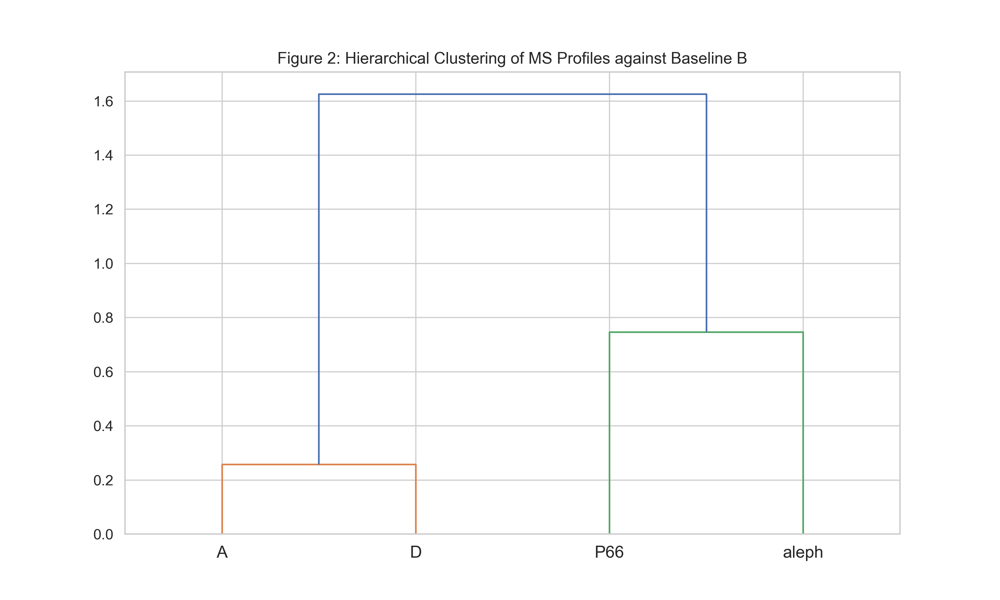
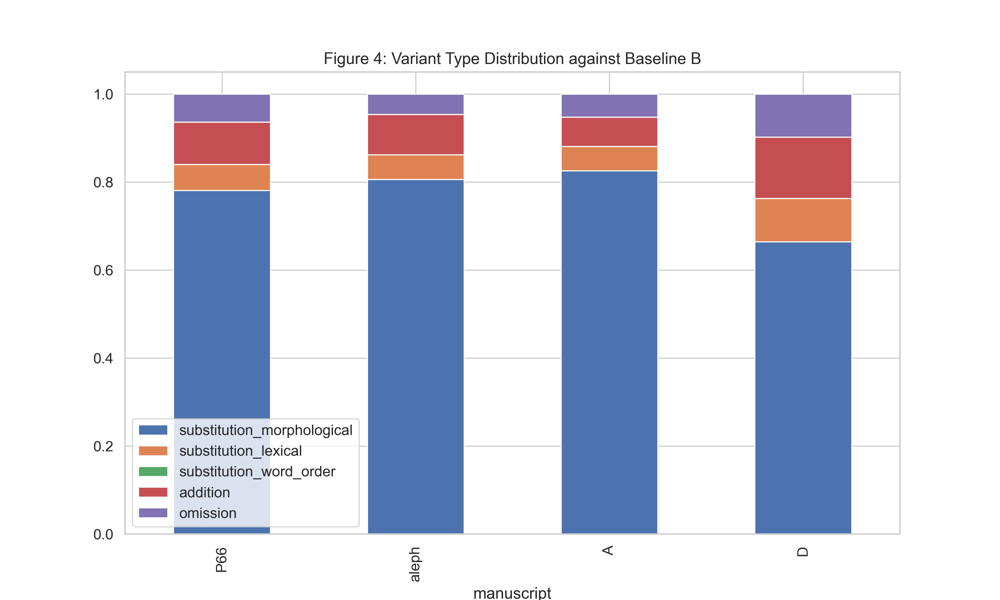
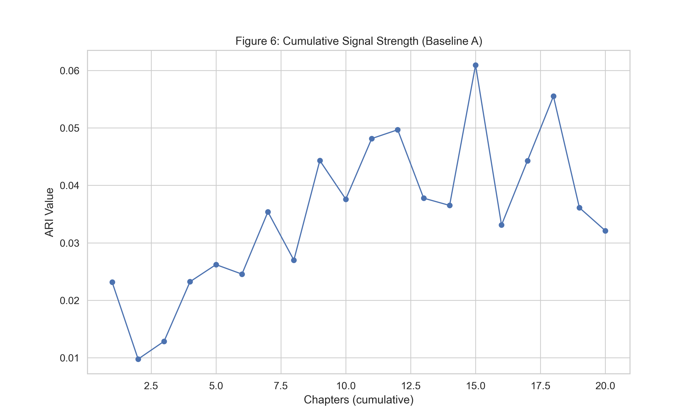
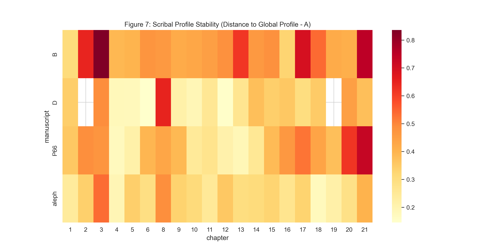

# Manuscript Textual Profile Analysis Engine

[Interactive Website](https://agnieszkachr.github.io/scribal-fingerprints/) · [GitHub Repository](https://github.com/Agnieszkachr/scribal-fingerprints)
[](https://doi.org/10.5281/zenodo.19153695)

This repository contains the codebase, extraction pipelines, and analytical scripts supporting the approach to analyzing New Testament variants.
The project investigates whether ancient New Testament manuscripts possess statistically detectable stylistic signatures (manuscript profiles) using a combination of classical stylometric typology and contextual Deep Learning embeddings (`Ancient-Greek-BERT`). 

## Important Methodological Note

This tool identifies **manuscript-level textual profiles** based on patterns 
of variation. These profiles reflect the aggregate textual tradition of a 
witness and may be influenced by:

1. Text-type affiliation (Alexandrian, Western, Byzantine)
2. Exemplar tradition inherited by the copyist  
3. Individual scribal habits and preferences

**The current methodology cannot reliably disentangle these factors.** 
Users should interpret "profiles" as manuscript-level characteristics, 
not necessarily as individual scribal fingerprints.

## Known Limitations

### 1. Text-Type Confound
- Effect sizes are small (Cohen's d ≈ 0.12, ARI ≈ 0.05)
- In the 5-manuscript pilot, Codex Bezae (Western text-type) may drive most profile separation.
- Within-text-type variation analysis required to validate scribal vs. text-type signal.

### 2. Effect Size Interpretation
- While statistically significant (p < 0.001), effect sizes indicate weak separation.
- Approximately 13+ chapters required for signal stabilization.
- Clustering alignment with manuscript identity is low (ARI ≈ 0.05).

### 3. Embedding Limitations
- Profile separation collapses 70% when lexical content is masked.
- Embeddings capture lexical tradition more than morphosyntactic structure.
- Ancient-Greek-BERT trained primarily on Classical Greek; Koine performance not fully validated.

## Key Results

### Hierarchical clustering of manuscript profiles

<p align="center">
  
</p>

Manuscript change profiles cluster by witness identity. P66 and Sinaiticus form a distinct branch from Alexandrinus, Vaticanus, and Bezae.

### Variant type distribution across manuscripts

<p align="center">
  
</p>

Proportional breakdown of morphological substitutions, lexical substitutions, additions, omissions, and word order shifts per manuscript. Codex Bezae shows a markedly different distribution.

### Cumulative signal stabilisation

<p align="center">
  
</p>

ARI as a function of cumulative chapter count. The signal stabilises around 13 chapters, indicating a minimum viable corpus of approximately half the Gospel.

### Chapter-level stability heatmap

<p align="center">
  
</p>

Per-chapter cosine distance from each manuscript's global centroid. Lower values (lighter cells) indicate chapters where the local profile closely matches the overall fingerprint.

## Repository Structure

```text
├── LICENSE                             # MIT License
├── README.md                           # This file
├── requirements.txt                    # Python package dependencies
├── download_itsee_data.py              # Fetches raw TEI XML from ITSEE, extracts & classifies variants
├── run_statistical_tests.py            # Bootstrapped inference (Cramér's V, Cohen's d, ARI, PCA)
├── profile_scribes.py                  # Generates BERT embeddings & change vectors from variant CSVs
├── create_visualizations.py            # Generates all figures (PCA, dendrograms, heatmaps, LLN curves)
├── create_verse_matched_dataset.py     # Generates the verse-matched ablation subset
├── recalc_odd_even.py                  # Odd/Even split replicability (Mantel/Spearman ρ)
├── run_ablation_study.py               # Function-word-only and content-masked ablation
├── data/                               # Extracted variant CSVs and raw XML
└── outputs/                            # Generated figures, reports, embeddings
```

## Methodological Details

### Variant Classification
Variants are classified into 5 categories using classical textual criticism typologies:
- **Morphological substitution**: Variants where morphology isolates the difference (e.g. ειπεν vs ειπον).
- **Lexical substitution**: Variants changing the root word or synonym (e.g. ιησους vs κυριος).
- **Word order**: Inversions or broader syntactical rearrangements.
- **Addition**: Surplus words against the baseline.
- **Omission**: Missing words against the baseline.

Ambiguous cases are currently classified based on heuristic precedence.

### Orthographic Filtering
The following alternations are filtered as non-substantive prior to profiling:
- Itacisms: ει/ι, αι/ε, η/ι, οι/υ, ω/ο
- Movable nu: ν-ephelkystikon (ν/∅ at word ends)
- Elision and crasis variations
- Accentuation and rough/smooth breathing variations (if applicable)

### Statistical Framework
- Block-bootstrap at chapter level (B=200 resamples for Cramér's V; B=100 for Cohen's d).
- Block permutation tests (N=100–200 depending on metric) for empirical p-values.
- All CIs reported at 95% level.
- All analyses now report null distribution statistics alongside observed values to contextualize effect sizes.

## Output Interpretation

### What Profiles Represent
Manuscript profiles capture manuscript-level patterns of textual variation.
High similarity between profiles may indicate:
- Shared text-type affiliation (most likely in current data)
- Common exemplar tradition
- Similar scribal training or scriptorium practices
- Geographic/temporal proximity

Low effect sizes in current implementation suggest text-type is the dominant factor.

### What Profiles Do NOT Prove
- Individual scribe identification (confounded with text-type).
- Intentional vs. unintentional changes (requires separate analysis).
- Directionality of change (requires genealogical analysis, e.g., CBGM).

## Relationship to Existing Methods

### Comparison with CBGM
The Coherence-Based Genealogical Method (CBGM) used in the Editio Critica Maior addresses different questions:
- CBGM: Genealogical relationships and textual flow direction
- This tool: Aggregate change profile characterization
Future work will formally compare profile similarity with CBGM coherence measures to assess whether profiles provide information beyond genealogy.

### Comparison with Scribal Habits Literature
Traditional scribal habits studies (Royse, Head, Hernández) focus on identified tendencies in specific manuscripts (singular vs. plural, article usage, verb forms) via manual analysis. This tool provides automated, corpus-scale analysis and quantified effect sizes with uncertainty, but cannot yet reliably attribute patterns to individual scribes vs. tradition.

## Default Pipeline Execution

```bash
# 1. Install dependencies (uv recommended; pip also works)
uv pip install -r requirements.txt

# 2. Download TEI XML and extract variant CSVs for each baseline
python download_itsee_data.py

# 3. (Optional) Build verse-matched ablation subset
python create_verse_matched_dataset.py

# 4. Run statistical analysis (generates embeddings, bootstrapped CIs, reports)
python run_statistical_tests.py

# 5. Generate visualizations
python create_visualizations.py

# 6. (Optional) Odd/Even split replicability
python recalc_odd_even.py

# 7. (Optional) Content ablation study
python run_ablation_study.py
```

## Interactive Website

[https://agnieszkachr.github.io/scribal-fingerprints/](https://agnieszkachr.github.io/scribal-fingerprints/)

An interactive companion website presents the research results with dynamic
visualisations and a variant explorer. The site is a standalone static
HTML/CSS/JS application in the `docs/` directory, deployed via GitHub Pages.

**Pages:**
- **Home** — Key findings and summary statistics
- **Methodology** — Pipeline diagram, variant typology, manuscript coverage heatmap
- **Results** — Interactive Plotly.js charts (type distribution, cumulative ARI,
  stability heatmap, ablation comparison) and a static figure gallery
- **Explorer** — Searchable, filterable DataTables browser with ~2,000 stratified
  variant samples including Ancient Greek readings
- **About** — Project context, data sources, citation, and acknowledgements

To serve locally: `cd docs && python -m http.server 8080`

To regenerate the website data files from pipeline outputs:
```bash
cd docs
python prepare_website_data.py
```

## License

This project is licensed under the [MIT License](LICENSE).

## Citation

If you use this code or data, please cite:

> Ziemińska, A. B. (2026). *The Typological Structure of Textual Variation: A Computational Analysis of Major Witnesses to the Gospel of John.* Zenodo. https://doi.org/10.5281/zenodo.19153695

```bibtex
@article{zieminska2026scribal_software,
  author    = {Ziemińska, Agnieszka B.},
  title     = {The Typological Structure of Textual Variation:
               A Computational Analysis of Major Witnesses
               to the Gospel of John (Software & Data)},
  year      = {2026},
  publisher = {Zenodo},
  doi       = {10.5281/zenodo.19153695},
  url       = {https://doi.org/10.5281/zenodo.19153695}
}
```
